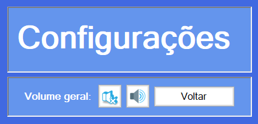

<h1 align="center" style="font-weight: bold;"> The Adventure Seeker</h1>

 <a href="#layout">Layout</a> • 
 <a href="#tech">Technologies</a> • 
 <a href="#characters">Characters</a> • 
  •
 <a href="#license">License</a>

    <b>A mini RPG game, made with C# and Windows Forms</b>

<h2 id="layout">🎨 Layout</h2>

    
    
    
    
    
    
    

<h2 id="tech">💻 Technologies</h2>

<h2 id="characters"> Characters</h2>

<table>
  <tr>
    <td align="center">
         
          <b>Archer</b>
    </td>
    <td align="center">
        
Excellent shooters with a bow. Their affinity and dedication to a single type of weapon allows them to perform true feats when they shoot their arrows.

    </td>
  </tr>
   <tr>
    <td align="center">
         
          <b>Knight</b>
    </td>
    <td align="center">
        
Knights are very resistant, most of the time having heavy armor and also long weapons with more destructive power.

    </td>
  </tr>
   <tr>
    <td align="center">
         
          <b>Cleric</b>
    </td>
    <td align="center">
        
A cleric acts as an intermediary agent, controlling divine powers, also possessing the power to heal wounds with just his faith, in the same way that he can cause injuries and illnesses with the same method.

    </td>
  </tr>
   <tr>
    <td align="center">
         
          <b>Wizard</b>
    </td>
    <td align="center">
        
Wizards are able to use natural and elemental powers such as Earth, Fire, Water and Air. But their greatest power is to conjure White magic, such as strong rays of light and healing powers.

    </td>
  </tr>
   <tr>
    <td align="center">
         
          <b>Paladin</b>
    </td>
    <td align="center">
        
They have combat skills like a warrior along with the strength of a Berserker, and they pay devotion to the gods, thus obtaining the power necessary to cast their spells.

    </td>
  </tr>
</table>
           
<h2 id="colab">🤝 Collaborators</h2>

<table>
  <tr>
    <td align="center">
      <a href="https://github.com/lucassantuss">
         
          <b>Lucas Araujo</b>
      </a>
    </td>
    <td align="center">
      <a href="https://github.com/">
         
          <b>Augusto Daimon</b>
      </a>
    </td>
    <td align="center">
      <a href="https://github.com/">
         
          <b>Eduardo Mano</b>
      </a>
    </td>
    <td align="center">
      <a href="https://github.com/">
         
          <b>Gabriel Tawada</b>
      </a>
    </td>
    <td align="center">
      <a href="https://github.com/">
         
          <b>Rickson Takeshi</b>
      </a>
    </td>
    <td align="center">
      <a href="https://github.com/">
         
          <b>Yuri Watanabe</b>
      </a>
    </td>
  </tr>
</table>

<h2 id="license">🧾 License</h2>

This software is available under the following licenses:

- [MIT](LICENSE)
